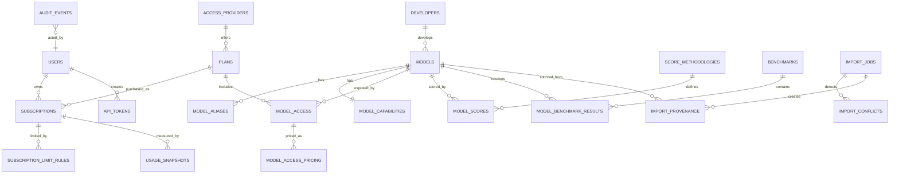

# Entity Relationship Diagram

## Ownership boundaries

- Models do not own subscriptions.
- Plans do not represent personal billing state.
- Subscription limits belong to personal subscriptions unless explicitly global to a plan.
- Model access is the only supported connection between a canonical model and a plan.
- Scores and benchmarks are independent evidence layers.
