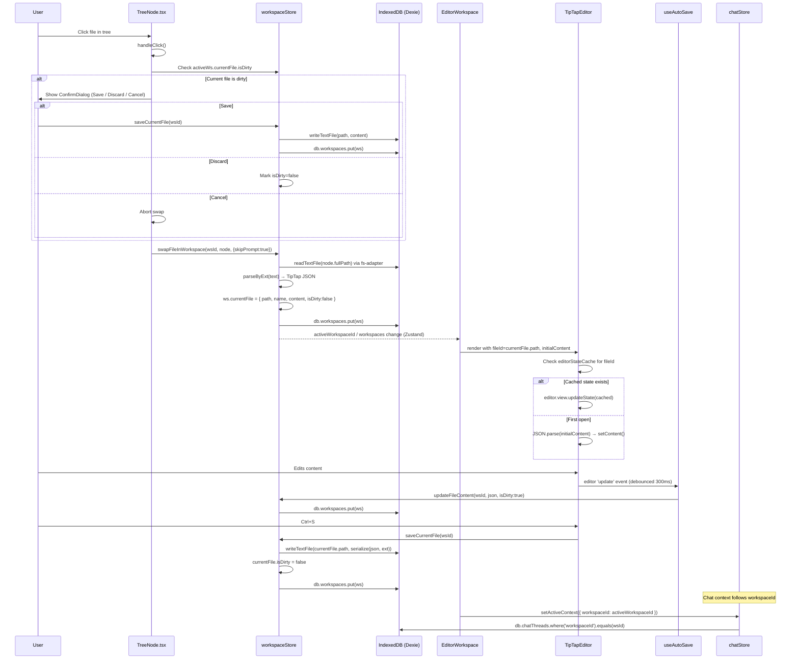

# Workspace Pivot — Feature Implementation Plan

> **Date:** 2026-07-10
> **Status:** Draft — pending approval
> **Scope:** Pivot tabs from per-file documents to per-workspace containers with isolated folders and single-file editor swapping.

---

## 1. Decisions Summary (from interview)

| Question | Decision |
|----------|----------|
| Files per workspace | **One file at a time** — clicking a new file swaps the editor content |
| Folders per workspace | **Own folder set per workspace** — each workspace manages its own connected folders independently |
| Tab label | **Folder/workspace name** — fixed name (root folder name or custom), stays constant regardless of open file |
| New workspace creation | **Blank, connect folder later** — "+" creates an empty workspace; user connects a folder via the file tree panel |
| Unsaved-changes prompt | **Modal: Save / Discard / Cancel** — same `ConfirmDialog` pattern currently used for tab close |
| AI chat scope | **Chat per workspace** — each workspace has its own chat history; switching workspaces switches the conversation |
| Migration strategy | **Start fresh** — clear existing documents; start with one blank workspace |
| Middle-click behavior | **Open new workspace** — middle-click on a file creates a new workspace with that file's folder connected and the file loaded |
| Split editor | **Per workspace** — split editor is a workspace-level setting; two files side by side in the same workspace |

---

## 2. Current Architecture (Baseline)

```
File Tree click
  → documentStore.openFileFromTree(node)
  → creates/activates a Document (tab)
  → activeDocumentId changes
  → EditorWorkspace re-renders
  → TipTapEditor loads content
  → useAutoSave persists to IndexedDB
  → useSaveDocument writes to disk via fs-adapter
```

**Key facts:**
- Tabs **are** `Document` objects — `documentStore.documents[]` is the tab list.
- A single `TipTapEditor` instance is reused; ProseMirror state is cached per document ID in a module-level `Map`.
- Connected folders are **global** in `fileSystemStore` — all tabs share the same file tree.
- Chat threads are tied to `documentId` via `ChatThreadMeta.documentId`.
- Dexie schema is at **v11** with tables: `documents`, `chatMessages`, `chatThreads`, `fileHandles`, `tasks`, `projects`, `agents`, `providerConfigs`, `settings`, `quickPrompts`, `actionGroups`, `taskComments`, `taskAIChangeBatches`.

---

## 3. Target Architecture

```
Workspace Tab click
  → workspaceStore.setActiveWorkspace(id)
  → activeWorkspaceId changes
  → EditorWorkspace loads workspace.currentFile into TipTapEditor
  → FileExplorerPanel shows workspace.connectedFolders tree
  → AISidebar loads workspace-scoped chat threads

File Tree click (within active workspace)
  → workspaceStore.swapFileInWorkspace(node)
  → if currentFile.isDirty → show ConfirmDialog (Save / Discard / Cancel)
  → on confirm: save/discard old file, load new file into editor
  → TipTapEditor swaps content (ProseMirror state cached per filePath)

Middle-click on file
  → workspaceStore.createWorkspace() + connectFolder(file's parent) + load file
```

### 3.1 Conceptual Model

```
Workspace (tab)
├── id, name (label), colorIndex, order
├── connectedFolders[]      ← isolated per workspace
├── activeFolderId          ← which folder's tree is shown
├── currentFile             ← the one file open in the editor
│   ├── path, name, content (TipTap JSON), isDirty
│   └── (ProseMirror state cached in memory by path)
├── splitEditorOpen         ← workspace-level split flag
├── splitFile               ← second file for split mode
├── expandedPaths           ← per-workspace tree expansion state
├── selectedTreePath        ← per-workspace tree selection
└── chat threads            ← scoped to workspaceId
```

---

## 4. Type Changes

### 4.1 New Types (`src/types/index.ts`)

```typescript
/** A file currently open in a workspace's editor. */
export interface WorkspaceFile {
  path: string;         // absolute disk path (forward slashes)
  name: string;         // display name (filename with extension)
  content: string;      // TipTap JSON serialized as string
  isDirty: boolean;     // has unsaved changes vs disk
}

/** A workspace — the new tab entity. */
export interface Workspace {
  id: string;                          // nanoid(8)
  name: string;                        // tab label (folder name or custom)
  connectedFolders: ConnectedFolder[]; // per-workspace folder set
  activeFolderId: string | null;       // which folder's tree is shown
  currentFile: WorkspaceFile | null;   // the file open in the editor
  splitFile: WorkspaceFile | null;     // second file for split editor
  splitEditorOpen: boolean;            // split editor toggle
  expandedPaths: string[];             // per-workspace tree expansion state
  selectedTreePath: string | null;     // per-workspace tree selection
  createdAt: number;
  updatedAt: number;
  order: number;
  colorIndex?: number;                 // 0-5 rainbow color
}
```

> **Note:** `ConnectedFolder` stays as-is (`{ id, path, rootNode }`) but moves from `fileSystemStore` global state into each `Workspace`.

### 4.2 Modified Types

```typescript
// ChatThreadMeta — replace documentId with workspaceId
export interface ChatThreadMeta {
  id: string;
  mode: 'writer' | 'task';
  workspaceId?: string;     // ← was documentId
  taskId?: string;
  settingsTab?: string;
  title: string;
  createdAt: number;
  updatedAt: number;
  permissionMode?: 'ask' | 'bypass';
}

// ChatMessage — replace documentId with workspaceId
export interface ChatMessage {
  id: string;
  threadId: string;
  mode: 'writer' | 'task';
  workspaceId?: string;     // ← was documentId
  taskId?: string;
  settingsTab?: string;
  // ... rest unchanged
}
```

### 4.3 Deprecated Types

`Document` interface — **remove** after migration is complete. No longer used.

---

## 5. Database Changes (`src/services/db.ts`)

### 5.1 Schema Upgrade: v11 → v12

```typescript
// v12 upgrade
db.version(12).stores({
  // NEW table
  workspaces: 'id, name, updatedAt, order',
  // MODIFIED — swap documentId index for workspaceId
  chatThreads: 'id, mode, updatedAt, workspaceId, taskId, settingsTab',
  chatMessages: 'id, threadId, mode, agentId, timestamp, settingsTab, workspaceId',
  // REMOVE documents table (start fresh)
  documents: null,  // Dexie syntax to drop a table
  // fileHandles is no longer used (folders live inside workspaces now)
  fileHandles: null,
  // ... all other tables unchanged
}).upgrade(async (tx) => {
  // Clear old chat data (start fresh)
  await tx.table('chatThreads').clear();
  await tx.table('chatMessages').clear();
});
```

### 5.2 New Table Definition

```typescript
class ZenEditorDB extends Dexie {
  // ... existing tables
  workspaces!: Table<Workspace>;  // NEW
  // documents!: Table<Document>;  // REMOVED
  // fileHandles!: Table<FileHandleRecord>;  // REMOVED
}
```

---

## 6. New Store: `src/stores/workspaceStore.ts`

This is the **core** of the refactor. It replaces `documentStore.ts` and absorbs the folder-management state from `fileSystemStore.ts`.

### 6.1 State

```typescript
interface WorkspaceStore {
  workspaces: Workspace[];
  activeWorkspaceId: string | null;
  isLoaded: boolean;

  // ── Workspace lifecycle ──
  loadWorkspaces: () => Promise<void>;
  createWorkspace: (name?: string) => Promise<Workspace>;
  deleteWorkspace: (id: string) => Promise<void>;
  setActiveWorkspace: (id: string) => void;
  renameWorkspace: (id: string, name: string) => void;
  duplicateWorkspace: (id: string) => Promise<Workspace>;
  updateWorkspace: (id: string, updates: Partial<Workspace>) => void;

  // ── File operations within workspace ──
  swapFileInWorkspace: (workspaceId: string, node: TreeNode, opts?: { skipPrompt?: boolean }) => Promise<boolean>;
  openFileInWorkspace: (workspaceId: string, node: TreeNode) => Promise<void>;
  saveCurrentFile: (workspaceId: string) => Promise<void>;
  saveAsCurrentFile: (workspaceId: string) => Promise<void>;
  updateFileContent: (workspaceId: string, content: string, isDirty: boolean) => void;
  closeCurrentFile: (workspaceId: string) => void;

  // ── Split editor ──
  setSplitEditorOpen: (workspaceId: string, open: boolean) => void;
  swapSplitFile: (workspaceId: string, node: TreeNode) => Promise<void>;

  // ── Folder operations within workspace ──
  connectFolderInWorkspace: (workspaceId: string, fullPath?: string) => Promise<void>;
  disconnectFolderInWorkspace: (workspaceId: string, folderId: string) => Promise<void>;
  setActiveFolderInWorkspace: (workspaceId: string, folderId: string) => void;
  refreshWorkspaceDir: (workspaceId: string, dirPath: string) => Promise<void>;
  ensureChildrenLoaded: (workspaceId: string, fullPath: string) => Promise<void>;

  // ── File CRUD (delegated to fs-adapter, but tree update is per-workspace) ──
  createFileInWorkspace: (workspaceId: string, parentPath: string, name: string) => Promise<void>;
  createDirectoryInWorkspace: (workspaceId: string, parentPath: string, name: string) => Promise<void>;
  renameInWorkspace: (workspaceId: string, oldPath: string, newName: string) => Promise<void>;
  removeInWorkspace: (workspaceId: string, path: string) => Promise<void>;
  moveInWorkspace: (workspaceId: string, sourcePath: string, targetDirPath: string) => Promise<void>;

  // ── Tree state (per-workspace) ──
  toggleExpandedPath: (workspaceId: string, path: string) => void;
  setExpandedPaths: (workspaceId: string, paths: string[]) => void;
  setSelectedTreePath: (workspaceId: string, path: string | null) => void;

  // ── Tauri shell integration ──
  openFileByPath: (path: string) => Promise<void>;
}
```

### 6.2 Key Action Implementations

#### `loadWorkspaces()`
```
1. Read all workspaces from db.workspaces, sorted by order.
2. If empty → create one blank workspace, persist, set active.
3. If non-empty → set activeWorkspaceId from db.settings('lastActiveWorkspaceId').
4. For each workspace, verify connected folder paths still exist on disk;
   remove any that don't.
5. Set isLoaded = true.
```

#### `createWorkspace(name?)`
```
1. Generate id = nanoid(8).
2. Determine name: provided name, or "New Workspace" (or numbered if duplicate).
3. Cycle colorIndex from last workspace.
4. Create shell: { id, name, connectedFolders: [], activeFolderId: null,
   currentFile: null, splitFile: null, splitEditorOpen: false,
   expandedPaths: [], selectedTreePath: null, ... }
5. Persist to db.workspaces.
6. Set as activeWorkspaceId.
7. Persist lastActiveWorkspaceId to db.settings.
```

#### `swapFileInWorkspace(workspaceId, node, opts?)` — **THE CORE PIVOT**
```
1. Get workspace = workspaces.find(id).
2. If workspace.currentFile is null or !isDirty → skip to step 6.
3. If opts.skipPrompt is true → skip to step 6.
4. Show ConfirmDialog: "Save changes to {currentFile.name}?"
   - User clicks "Save" → await saveCurrentFile(workspaceId). Continue to step 6.
   - User clicks "Don't Save" → discard changes (mark isDirty=false). Continue to step 6.
   - User clicks "Cancel" → return false (abort the swap).
5. Read file from disk: text = await readTextFile(node.fullPath).
6. Parse: content = JSON.stringify(parseByExt(text, ext)).
7. Create WorkspaceFile: { path: node.fullPath, name: node.name, content, isDirty: false }.
8. Update workspace: { currentFile: newFile, selectedTreePath: node.path }.
9. Persist to db.workspaces.
10. Return true (swap succeeded).
```

> **Important:** The ConfirmDialog is shown by the **caller** (the component), not inside the store. The store exposes a `checkDirtyAndSwap` helper that returns a discriminated union: `{ type: 'proceed' } | { type: 'cancelled' } | { type: 'needs-prompt', fileName: string }`. The component renders the dialog and calls `swapFileInWorkspace` again with `skipPrompt: true` after the user's choice. See § 8.3 for details.

#### `saveCurrentFile(workspaceId)`
```
1. Get workspace.currentFile.
2. If no currentFile → return.
3. If currentFile.path exists (file-backed):
   a. ext = getExt(currentFile.path) || 'md'.
   b. await writeTextFile(currentFile.path, serialize(JSON.parse(currentFile.content), ext)).
   c. Update workspace.currentFile.isDirty = false.
   d. Persist to db.workspaces.
4. If no path (shouldn't happen in workspace model — all files come from tree):
   → delegate to saveAsCurrentFile.
```

#### `connectFolderInWorkspace(workspaceId, fullPath?)`
```
1. If fullPath not provided → show folder picker via openFolderDialog().
2. If user cancels → return.
3. Build tree: rootNode = await buildTreeFromPath(fullPath).
4. Assign slot id = String(workspace.connectedFolders.length).
5. Push to workspace.connectedFolders.
6. Set workspace.activeFolderId = new folder id (if it's the first folder).
7. Persist workspace to db.workspaces.
```

#### `setActiveWorkspace(id)`
```
1. Set activeWorkspaceId = id.
2. useUIStore.setActiveView('document') (exit Settings).
3. Persist lastActiveWorkspaceId to db.settings.
```

#### `deleteWorkspace(id)`
```
1. Delete from db.workspaces.
2. Cascade: delete chatThreads where workspaceId === id.
3. If it was active → activate the last remaining workspace.
4. If no workspaces remain → auto-create a blank workspace.
```

---

## 7. Modified Stores

### 7.1 `fileSystemStore.ts` — Slim Down to Tree Helpers Only

The global folder state (`connectedFolders`, `activeFolderId`, `rootNode`) **moves into** `workspaceStore`. What remains in `fileSystemStore`:

- **Pure functions** (no state): `buildTreeFromPath()`, `buildChildren()`, `findNodeByFullPath()`, `flattenTree()`.
- **fs-adapter wrappers** that don't need workspace context: `readDir`, `readTextFile`, `writeTextFile`, `mkdir`, `remove`, `rename`, `exists`, `basename`, `joinPath`.
- **Loading/error state** for the currently active folder (transient UI state): `loading`, `error`, `needsReconnect`, `folderCapability`.

> **Alternative:** Move everything into `workspaceStore` and delete `fileSystemStore` entirely. This is cleaner but creates a very large store. **Recommendation:** Keep `fileSystemStore` for pure tree-building utilities and fs-adapter wrappers; move all stateful folder management into `workspaceStore`.

### 7.2 `chatStore.ts` — Swap `documentId` → `workspaceId`

Changes:
- `contextKey()` — replace `doc:${documentId}` with `ws:${workspaceId}`.
- `loadThreadsForContext()` — query `db.chatThreads.where('workspaceId').equals(...)`.
- `setActiveContext()` — params change from `{ documentId }` to `{ workspaceId }`.
- `newChat()` — `ChatThreadMeta.workspaceId` instead of `documentId`.
- All `ChatMessage.documentId` → `workspaceId`.

### 7.3 `uiStore.ts` — Per-Workspace Tree State

Currently `uiStore` holds `expandedPaths` and `selectedTreePath` globally. These move into each `Workspace` object (see § 4.1). The `uiStore` actions `setExpandedPaths`, `setSelectedTreePath` are removed; replaced by `workspaceStore.toggleExpandedPath`, `workspaceStore.setSelectedTreePath`.

Other `uiStore` state (`fileExplorerOpen`, `aiSidebarOpen`, `activeView`, `taskMode`, `crmMode`, etc.) remains global.

---

## 8. Component Changes

### 8.1 `TabBar.tsx` — Render Workspace Tabs

**Before:** Reads `useDocumentStore().documents`, renders `<Tab>` per document, "+" calls `createDocument()`.

**After:** Reads `useWorkspaceStore().workspaces`, renders `<WorkspaceTab>` per workspace, "+" calls `createWorkspace()`.

Mode switching logic (settings/task/CRM tabs) stays unchanged — only the writer-mode tab source changes.

```typescript
// Writer mode
const { workspaces, activeWorkspaceId, setActiveWorkspace,
        deleteWorkspace, createWorkspace, renameWorkspace } = useWorkspaceStore();

// Render
workspaces.map((ws) => (
  <WorkspaceTab
    key={ws.id}
    workspace={ws}
    isActive={ws.id === activeWorkspaceId}
    onSelect={() => setActiveWorkspace(ws.id)}
    onClose={() => deleteWorkspace(ws.id)}
    onRename={(name) => renameWorkspace(ws.id, name)}
  />
))
// + button
<button onClick={() => createWorkspace()}>+</button>
```

### 8.2 `Tab.tsx` → `WorkspaceTab.tsx` — New Component

**Key differences from current `Tab.tsx`:**
- **Label:** Shows `workspace.name` (fixed, doesn't change with file swaps).
- **Dirty indicator:** Shows a dot when `workspace.currentFile?.isDirty` is true.
- **Close logic:** If `workspace.currentFile?.isDirty`, show `ConfirmDialog` before closing the entire workspace (save the current file, then delete workspace).
- **Rename:** Double-click renames the **workspace**, not the file.
- **No `isReplaceable` concept** — workspaces are never auto-replaced. The blank workspace stays until explicitly closed.

### 8.3 `TreeNode.tsx` — Swap Instead of Open Tab

**Before:**
```typescript
const handleClick = async () => {
  // ...
  if (node.kind === 'file') {
    await openFileFromTree(node, false);  // opens new tab
  }
};

const onAuxClick = async (e) => {
  if (e.button === 1 && node.kind === 'file') {
    await openFileFromTree(node, true);  // force new tab
  }
};
```

**After:**
```typescript
const handleClick = async () => {
  // ...
  if (node.kind === 'file') {
    await handleFileSwap(node);
  }
};

const onAuxClick = async (e) => {
  if (e.button === 1 && node.kind === 'file') {
    // Middle-click → new workspace with this file's folder
    await openInNewWorkspace(node);
  }
};
```

**`handleFileSwap(node)` — the unsaved-changes flow:**
```typescript
const handleFileSwap = async (node: TreeNodeType) => {
  const ws = useWorkspaceStore.getState();
  const activeWs = ws.workspaces.find(w => w.id === ws.activeWorkspaceId);
  if (!activeWs) return;

  const currentFile = activeWs.currentFile;

  // No current file or not dirty → swap immediately
  if (!currentFile || !currentFile.isDirty) {
    await ws.swapFileInWorkspace(activeWs.id, node, { skipPrompt: true });
    return;
  }

  // Dirty file → show confirm dialog
  setPendingSwap({ fileName: currentFile.name, targetNode: node });
};

// In the confirm dialog handler:
const onConfirmSave = async () => {
  await ws.saveCurrentFile(activeWs.id);
  await ws.swapFileInWorkspace(activeWs.id, pendingSwap.targetNode, { skipPrompt: true });
  setPendingSwap(null);
};

const onConfirmDiscard = async () => {
  await ws.swapFileInWorkspace(activeWs.id, pendingSwap.targetNode, { skipPrompt: true });
  setPendingSwap(null);
};

const onConfirmCancel = () => {
  setPendingSwap(null);  // abort swap
};
```

**`openInNewWorkspace(node)` — middle-click flow:**
```typescript
const openInNewWorkspace = async (node: TreeNodeType) => {
  const ws = useWorkspaceStore.getState();
  // 1. Create new blank workspace
  const newWs = await ws.createWorkspace();
  // 2. Connect the file's parent folder
  const parentPath = node.fullPath.substring(0, node.fullPath.lastIndexOf('/'));
  await ws.connectFolderInWorkspace(newWs.id, parentPath);
  // 3. Load the file into the new workspace
  await ws.swapFileInWorkspace(newWs.id, node, { skipPrompt: true });
  // 4. Set workspace name to the folder name
  const folderName = parentPath.split('/').pop() || 'Workspace';
  ws.renameWorkspace(newWs.id, folderName);
};
```

### 8.4 `EditorWorkspace.tsx` — Connect to WorkspaceStore

**Before:** Reads `activeDocumentId`, `documents` from `documentStore`. Passes `documentId` and `initialContent` to `TipTapEditor`.

**After:** Reads `activeWorkspaceId`, `workspaces` from `workspaceStore`. Passes `fileId` (the current file's path) and `initialContent` to `TipTapEditor`.

```typescript
const { workspaces, activeWorkspaceId, updateFileContent, updateWorkspace } = useWorkspaceStore();
const activeWs = workspaces.find(w => w.id === activeWorkspaceId);
const currentFile = activeWs?.currentFile;

// Pass to TipTapEditor
<TipTapEditor
  fileId={currentFile?.path ?? null}      // ← was documentId
  initialContent={currentFile?.content ?? ''}
  workspaceId={activeWorkspaceId}          // ← for auto-save targeting
  // ...
/>
```

**Empty state:** When `activeWs` has no `currentFile`, show a placeholder ("Open a file from the tree" or "Connect a folder to get started").

**Split editor:** When `activeWs.splitEditorOpen` is true, render a second `TipTapEditor` with `activeWs.splitFile`.

### 8.5 `TipTapEditor.tsx` — Cache State Per File Path

**Before:** Caches ProseMirror state per `documentId` in `editorStateCache: Map<string, EditorState>`.

**After:** Caches ProseMirror state per **file path** in `editorStateCache: Map<string, EditorState>`. The `useEffect` that loads content now keys on `fileId` (the file path) instead of `documentId`.

```typescript
// Module-level cache — keyed by file path
const editorStateCache = new Map<string, EditorState>();

useEffect(() => {
  if (!editor) return;
  const prevId = previousFileIdRef.current;
  if (prevId && prevId !== fileId) {
    editorStateCache.set(prevId, editor.state);
  }
  const cached = fileId ? editorStateCache.get(fileId) : undefined;
  if (cached) {
    editor.view.updateState(cached);
  } else {
    const parsed = initialContent ? JSON.parse(initialContent) : null;
    if (parsed) editor.commands.setContent(parsed);
    else editor.commands.clearContent();
  }
  previousFileIdRef.current = fileId;
}, [editor, fileId]);
```

> **Note:** When a file is saved or discarded during a swap, its cache entry should be cleared so the next open gets fresh content from disk. The `swapFileInWorkspace` action calls a `clearEditorStateCache(path)` helper.

### 8.6 `FileExplorerPanel.tsx` — Per-Workspace Folders

**Before:** Reads `rootNode`, `connectedFolders`, `activeFolderId` from `fileSystemStore`. Calls `openFileFromTree` from `documentStore`.

**After:** Reads from the active workspace via `workspaceStore`:
```typescript
const { workspaces, activeWorkspaceId } = useWorkspaceStore();
const activeWs = workspaces.find(w => w.id === activeWorkspaceId);
const activeFolder = activeWs?.connectedFolders.find(f => f.id === activeWs.activeFolderId);
const rootNode = activeFolder?.rootNode ?? null;
const expandedPaths = activeWs?.expandedPaths ?? [];
const selectedTreePath = activeWs?.selectedTreePath ?? null;
```

Folder operations (`connectFolder`, `disconnectFolder`, `setActiveFolderId`) call `workspaceStore.connectFolderInWorkspace(activeWorkspaceId, ...)`, etc.

File CRUD operations (`createFile`, `createDirectory`, `rename`, `remove`) call `workspaceStore.createFileInWorkspace(activeWorkspaceId, ...)`, etc. These delegate to `fs-adapter` for the actual disk operation, then update the workspace's tree in memory.

**Polling:** The 10-second `refreshDir` interval now calls `workspaceStore.refreshWorkspaceDir(activeWorkspaceId, path)` for the active workspace's root and expanded paths.

### 8.7 `FileTreeTabs.tsx` — Folder Switcher Within Workspace

**Before:** Reads `connectedFolders` and `activeFolderId` from `fileSystemStore`. "+" calls `fileSystemStore.connectFolder()`.

**After:** Reads from the active workspace:
```typescript
const activeWs = workspaces.find(w => w.id === activeWorkspaceId);
const folders = activeWs?.connectedFolders ?? [];
const activeFolderId = activeWs?.activeFolderId ?? null;

// Switch folder
onClick={(id) => workspaceStore.setActiveFolderInWorkspace(activeWorkspaceId, id)}

// Add folder
onClick={() => workspaceStore.connectFolderInWorkspace(activeWorkspaceId)}
```

### 8.8 `EditorTopBar.tsx` — Show Current File Name

**Before:** Shows `doc.title` as the document title.

**After:** Shows `workspace.currentFile?.name` as the current file name. The workspace name is shown in the tab bar. The top bar can show a breadcrumb: `workspace.name / currentFile.name`.

Save button behavior: calls `workspaceStore.saveCurrentFile(activeWorkspaceId)`.

### 8.9 `AISidebar` / Chat Components — Workspace Context

**Before:** Chat components call `chatStore.setActiveContext({ documentId: activeDocumentId })`.

**After:** Chat components call `chatStore.setActiveContext({ workspaceId: activeWorkspaceId })`.

This is a find-and-replace of `documentId` → `workspaceId` in:
- `src/components/aiChat/AISidebar.tsx` (or equivalent)
- Any component that calls `chatStore.setActiveContext` or `chatStore.newChat`
- `src/hooks/useStreamingChat.ts` (if it references `documentId`)
- `src/hooks/useAgentLoop.ts` (if it references `documentId`)

---

## 9. Hook Changes

### 9.1 `useAutoSave.ts` — Save to Workspace's Current File

**Before:**
```typescript
export function useAutoSave(editor: Editor | null, documentId: string | null) {
  // ...
  updateDocument(documentId, { content: json, isDirty: true });
}
```

**After:**
```typescript
export function useAutoSave(editor: Editor | null, workspaceId: string | null) {
  const updateFileContent = useWorkspaceStore((s) => s.updateFileContent);
  // ...
  const handleUpdate = () => {
    timerRef.current = setTimeout(() => {
      const json = JSON.stringify(editor.getJSON());
      updateFileContent(workspaceId, json, true);
    }, 300);
  };
}
```

`updateFileContent` in `workspaceStore`:
```typescript
updateFileContent: (workspaceId, content, isDirty) => {
  set((s) => ({
    workspaces: s.workspaces.map((w) =>
      w.id === workspaceId && w.currentFile
        ? { ...w, currentFile: { ...w.currentFile, content, isDirty }, updatedAt: Date.now() }
        : w
    ),
  }));
  // Persist to Dexie (debounced or immediate)
  const ws = get().workspaces.find(w => w.id === workspaceId);
  if (ws) void db.workspaces.put(ws);
}
```

### 9.2 `useSaveDocument.ts` — Save Workspace's Current File

**Before:** Reads `activeDocumentId`, `documents` from `documentStore`. Writes to `doc.sourcePath`.

**After:** Reads `activeWorkspaceId`, `workspaces` from `workspaceStore`. Writes to `workspace.currentFile.path`.

```typescript
export function useSaveDocument() {
  const { workspaces, activeWorkspaceId, updateFileContent } = useWorkspaceStore();

  return useCallback(async (editor: Editor | null) => {
    if (!editor || !activeWorkspaceId) return;
    const ws = workspaces.find(w => w.id === activeWorkspaceId);
    if (!ws?.currentFile) return;

    const editorJson = editor.getJSON();
    const json = JSON.stringify(editorJson);

    // Update content in store
    updateFileContent(activeWorkspaceId, json, ws.currentFile.isDirty);

    // Write to disk
    const ext = getExt(ws.currentFile.path) || 'md';
    try {
      await writeTextFile(ws.currentFile.path, serialize(editorJson, ext));
      updateFileContent(activeWorkspaceId, json, false);  // isDirty = false
    } catch (err) {
      console.warn('[Save] disk write failed:', err);
    }
  }, [activeWorkspaceId, workspaces, updateFileContent]);
}
```

> **Note:** The "Save As" case (no `sourcePath`) is less relevant in the workspace model since all files come from the file tree and always have a path. However, if a user creates a blank workspace and starts typing without opening a file, we need a "new untitled file" flow. This is an edge case — see § 12.

---

## 10. File: `src/stores/editorRef.ts`

No changes. The `editorRef` is a mutable ref to the active TipTap editor instance, shared across components. It remains global.

---

## 11. Implementation Order (Phases)

### Phase 1: Types & Database (Foundation)
| Step | File | Action |
|------|------|--------|
| 1.1 | `src/types/index.ts` | Add `Workspace`, `WorkspaceFile` types. Modify `ChatThreadMeta`, `ChatMessage` to use `workspaceId`. Keep `Document` temporarily for compatibility. |
| 1.2 | `src/services/db.ts` | Add v12 schema upgrade. Add `workspaces` table. Drop `documents` and `fileHandles` tables. Clear old chat data. |

### Phase 2: New Store (Core Logic)
| Step | File | Action |
|------|------|--------|
| 2.1 | `src/stores/workspaceStore.ts` | **Create new file.** Implement all actions per § 6. Reuse tree-building logic from `fileSystemStore`. |
| 2.2 | `src/stores/fileSystemStore.ts` | Remove stateful folder management (`connectedFolders`, `activeFolderId`, `rootNode`, `connectFolder`, `disconnectFolder`, `setActiveFolderId`, `loadFileSystemSettings`). Keep pure tree utilities and fs-adapter wrappers. |
| 2.3 | `src/stores/chatStore.ts` | Replace all `documentId` references with `workspaceId`. Update `contextKey`, `loadThreadsForContext`, `setActiveContext`, `newChat`. |
| 2.4 | `src/stores/uiStore.ts` | Remove `expandedPaths`, `selectedTreePath`, `setExpandedPaths`, `setSelectedTreePath` (moved to workspace). |

### Phase 3: Components (UI Layer)
| Step | File | Action |
|------|------|--------|
| 3.1 | `src/components/header/WorkspaceTab.tsx` | **Create new file** (rename/replace `Tab.tsx`). Workspace tab with dirty indicator, close-with-save logic, rename. |
| 3.2 | `src/components/header/TabBar.tsx` | Switch from `documentStore` to `workspaceStore`. Render `WorkspaceTab` components. "+" calls `createWorkspace()`. |
| 3.3 | `src/components/header/DocumentTabDropdownItem.tsx` | Update `getDocumentTabMeta` → `getWorkspaceTabMeta` (or remove if no longer needed). |
| 3.4 | `src/components/editor/EditorWorkspace.tsx` | Switch from `documentStore` to `workspaceStore`. Pass `fileId` (file path) to `TipTapEditor`. Handle empty-workspace state. |
| 3.5 | `src/components/editor/TipTapEditor.tsx` | Change state cache key from `documentId` to `fileId` (file path). Update the content-loading `useEffect`. |
| 3.6 | `src/components/editor/EditorTopBar.tsx` | Show `workspace.currentFile.name`. Save button calls `workspaceStore.saveCurrentFile`. |
| 3.7 | `src/components/fileExplorer/TreeNode.tsx` | Replace `openFileFromTree` with `swapFileInWorkspace`. Add unsaved-changes confirm dialog. Middle-click → `openInNewWorkspace`. |
| 3.8 | `src/components/fileExplorer/FileExplorerPanel.tsx` | Read folder/tree state from active workspace. Delegate folder operations to `workspaceStore`. |
| 3.9 | `src/components/fileExplorer/FileTreeTabs.tsx` | Read `connectedFolders` from active workspace. Delegate to `workspaceStore`. |

### Phase 4: Hooks
| Step | File | Action |
|------|------|--------|
| 4.1 | `src/hooks/useAutoSave.ts` | Switch from `documentStore.updateDocument` to `workspaceStore.updateFileContent`. |
| 4.2 | `src/hooks/useSaveDocument.ts` | Switch from `documentStore` to `workspaceStore`. Save `workspace.currentFile` to disk. |

### Phase 5: Chat Integration
| Step | File | Action |
|------|------|--------|
| 5.1 | `src/components/aiChat/*.tsx` | Replace `documentId` with `workspaceId` in all `chatStore` calls. |
| 5.2 | `src/hooks/useStreamingChat.ts` | Replace `documentId` with `workspaceId`. |
| 5.3 | `src/hooks/useAgentLoop.ts` | Replace `documentId` with `workspaceId`. |
| 5.4 | `src/services/aiTools.ts` | Update `getWorkspaceRoot()` to read from active workspace's active folder. |

### Phase 6: App-Level Integration
| Step | File | Action |
|------|------|--------|
| 6.1 | `src/App.tsx` | Replace `loadDocuments()` with `loadWorkspaces()`. Replace `loadFileSystemSettings()` (no longer needed — folders load with workspaces). Update Tauri `tabs://open-file` handler to call `workspaceStore.openFileByPath()`. |
| 6.2 | `src/components/layout/AppLayout.tsx` | No structural changes, but verify panel visibility logic still works with workspace model. |

### Phase 7: Cleanup
| Step | File | Action |
|------|------|--------|
| 7.1 | `src/stores/documentStore.ts` | **Delete file.** All references should be migrated. |
| 7.2 | `src/types/index.ts` | Remove `Document` interface. |
| 7.3 | All files | Search for any remaining `documentStore`, `Document`, `documentId`, `openFileFromTree`, `openFileAsDocument` references and remove/replace. |
| 7.4 | `src/i18n/en.ts`, `src/i18n/tr.ts` | Add/update translations for workspace-related strings ("Workspace", "Save changes to", "Don't Save", etc.). |

---

## 12. Edge Cases & Decisions

### 12.1 Blank Workspace — No File Open
When a workspace has no `currentFile` (just created, or file was closed), the editor shows an empty state. The user can:
- Connect a folder and click a file to open it.
- Start typing → creates an untitled file. On save, show a "Save As" dialog to pick a path. The file is then saved to disk and set as `currentFile`.

### 12.2 File Deleted on Disk While Open
If a file is deleted externally while it's the `currentFile` in a workspace:
- The 10-second polling detects the deletion.
- The tree node is removed.
- The `currentFile` stays in memory with `isDirty = true` (content is preserved).
- On next swap or workspace close, the user is prompted to save → "Save As" dialog (since the original path no longer exists).

### 12.3 File Renamed on Disk While Open
If a file is renamed externally:
- Polling detects the rename (old path gone, new path appears).
- The `currentFile.path` is stale. On next save, the write fails.
- **Mitigation:** The polling logic should check if `currentFile.path` still exists. If not, search for a file with the same content hash in the same directory. If found, update `currentFile.path`. If not, mark as "missing" and prompt Save As on next save.

### 12.4 Workspace Name Auto-Update
When a folder is connected to a workspace that has a default name ("New Workspace"), auto-update the name to the folder's root directory name:
```typescript
// In connectFolderInWorkspace, after connecting:
if (workspace.name === 'New Workspace' || workspace.name.startsWith('New Workspace ')) {
  const folderName = fullPath.split('/').pop() || 'Workspace';
  updateWorkspace(workspaceId, { name: folderName });
}
```

### 12.5 Split Editor — Two Files Side by Side
When `splitEditorOpen` is true:
- The primary editor shows `currentFile`.
- The secondary editor shows `splitFile`.
- Clicking a file in the tree with split open → prompts: "Open in primary or secondary editor?" (or uses a keyboard modifier: regular click = primary, Alt+click = secondary).
- Each editor has its own ProseMirror state cache entry (keyed by file path).
- Auto-save targets whichever editor was last focused.

### 12.6 Multiple Workspaces with Same Folder
Two workspaces can connect the same folder. They share the same disk files but have independent:
- Tree expansion state
- Selected tree path
- Current file
- Chat history
- Split editor state

### 12.7 Tauri Shell "Open with TABS" Integration
When a file is opened via the OS shell (`tabs://open-file` event):
1. Find a workspace that has the file's parent folder connected.
2. If found → activate that workspace, swap to the file.
3. If not found → create a new workspace, connect the parent folder, load the file.

### 12.8 ProseMirror State Cache Cleanup
The `editorStateCache` (keyed by file path) grows unbounded. Add cleanup:
- When a file is saved (isDirty → false), remove its cache entry (content is on disk).
- When a workspace is deleted, remove cache entries for all its files.
- Cap the cache at 50 entries (LRU eviction).

---

## 13. Files to Create

| File | Purpose |
|------|---------|
| `src/stores/workspaceStore.ts` | New Zustand store — the core of the refactor |
| `src/components/header/WorkspaceTab.tsx` | New tab component for workspace tabs |

## 14. Files to Modify

| File | Changes |
|------|---------|
| `src/types/index.ts` | Add `Workspace`, `WorkspaceFile`; modify `ChatThreadMeta`, `ChatMessage`; remove `Document` |
| `src/services/db.ts` | v12 schema: add `workspaces`, drop `documents`/`fileHandles`, clear old chat |
| `src/stores/fileSystemStore.ts` | Remove stateful folder management; keep tree utilities |
| `src/stores/chatStore.ts` | `documentId` → `workspaceId` throughout |
| `src/stores/uiStore.ts` | Remove `expandedPaths`, `selectedTreePath` (moved to workspace) |
| `src/components/header/TabBar.tsx` | Switch to `workspaceStore`; render `WorkspaceTab` |
| `src/components/header/Tab.tsx` | Delete or rename to `WorkspaceTab.tsx` |
| `src/components/header/DocumentTabDropdownItem.tsx` | Update tab meta helper |
| `src/components/editor/EditorWorkspace.tsx` | Switch to `workspaceStore`; pass `fileId` to editor |
| `src/components/editor/TipTapEditor.tsx` | Cache state per file path; update content-loading effect |
| `src/components/editor/EditorTopBar.tsx` | Show current file name; save via `workspaceStore` |
| `src/components/fileExplorer/TreeNode.tsx` | Swap file logic + unsaved prompt + middle-click new workspace |
| `src/components/fileExplorer/FileExplorerPanel.tsx` | Read from active workspace; delegate to `workspaceStore` |
| `src/components/fileExplorer/FileTreeTabs.tsx` | Read folders from active workspace |
| `src/hooks/useAutoSave.ts` | Save to `workspaceStore.updateFileContent` |
| `src/hooks/useSaveDocument.ts` | Save `workspace.currentFile` to disk |
| `src/App.tsx` | `loadWorkspaces()` instead of `loadDocuments()`; update Tauri handler |
| `src/components/aiChat/*.tsx` | `documentId` → `workspaceId` in chat calls |
| `src/hooks/useStreamingChat.ts` | `documentId` → `workspaceId` |
| `src/hooks/useAgentLoop.ts` | `documentId` → `workspaceId` |
| `src/services/aiTools.ts` | `getWorkspaceRoot()` reads from active workspace |
| `src/i18n/en.ts` | Workspace-related strings |
| `src/i18n/tr.ts` | Workspace-related strings (Turkish) |

## 15. Files to Delete

| File | Reason |
|------|--------|
| `src/stores/documentStore.ts` | Replaced by `workspaceStore.ts` |
| `src/components/header/Tab.tsx` | Replaced by `WorkspaceTab.tsx` |

---

## 16. Risk Assessment

| Risk | Impact | Mitigation |
|------|--------|------------|
| **Dexie v12 upgrade fails** | High — app won't start | Test upgrade on a fresh DB and a populated DB. Add try/catch with fallback to clear-all-and-recreate. |
| **ProseMirror state cache key change** | Medium — undo history lost on first swap | Acceptable — start fresh means no existing state to preserve. |
| **Chat history loss** | Low — user chose "start fresh" | v12 upgrade clears chat data explicitly. |
| **fileSystemStore refactor breaks tree rendering** | High — file tree won't show | Keep tree-building functions in `fileSystemStore`; only move state. Test tree rendering early. |
| **Split editor complexity** | Medium — two editors, two caches | Defer split editor to a later iteration if time-constrained. Phase 3 can ship without split. |
| **Tauri shell integration regression** | Low — edge case | Test `tabs://open-file` event handler with new `workspaceStore.openFileByPath`. |
| **Many components reference `documentStore`** | High — widespread changes | Use grep to find all imports of `documentStore` and `Document` type. Migrate systematically. |

---

## 17. Testing Checklist

- [ ] App starts with one blank workspace (fresh DB)
- [ ] "+" button creates a new blank workspace
- [ ] Connecting a folder shows the file tree
- [ ] Clicking a file in the tree loads it in the editor
- [ ] Clicking a second file swaps the editor content
- [ ] Unsaved changes prompt appears when swapping dirty file
- [ ] "Save" in prompt writes to disk, then swaps
- [ ] "Don't Save" discards changes, then swaps
- [ ] "Cancel" aborts the swap
- [ ] Middle-click on a file creates a new workspace with the file's folder
- [ ] Workspace tab shows the folder/workspace name
- [ ] Dirty indicator (dot) appears on tab when current file has unsaved changes
- [ ] Closing a workspace with dirty file prompts to save
- [ ] Renaming a workspace updates the tab label
- [ ] Switching workspaces switches the file tree to that workspace's folders
- [ ] Switching workspaces switches the chat history
- [ ] Auto-save works (debounced 300ms to IndexedDB)
- [ ] Ctrl+S saves the current file to disk
- [ ] Split editor shows two files side by side
- [ ] Tauri "Open with TABS" opens file in an appropriate workspace
- [ ] App restarts and restores workspaces, active workspace, and current files
- [ ] File tree polling detects external changes
- [ ] Deleting a file in the tree that is currently open handles gracefully

---

## 18. Diagram: Target Data Flow


